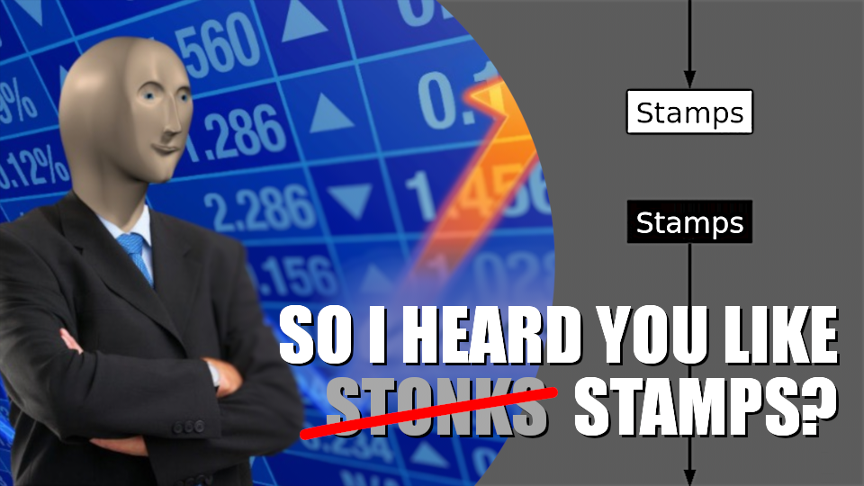

An investigation into the Stamps tool for Nuke, by Daniel Harkness.

This folder contains files in markdown format that can be used in your VFX studio's internal wiki for the compositing department.

[CC-BY-4.0 license](../LICENSE)

[So I heard you like Stamps? - Part 1](So%20I%20heard%20you%20like%20Stamps%20-%20Part%201.md)
